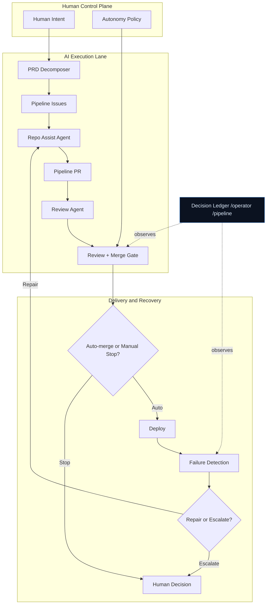

# PRD to Prod

`prd-to-prod` is a policy-bounded AI execution system for software delivery.
Humans define intent, policy, and escalation. AI executes decomposition,
implementation, review, merge preparation, and first-line repair inside that
boundary.

Software delivery is the proving ground, not the whole point. This repository
rebuilds a legacy workflow around modern AI: not as a suggestion layer on top of
old CI/CD, but as an operating loop with explicit authority limits, real failure
conditions, and visible operator controls.

> **Wealthsimple submission:** see [`SUBMISSION.md`](SUBMISSION.md) for the application brief and compliance service specimen.



## Human and AI Boundary

| Responsibility | Owner | Why |
|---|---|---|
| Product intent and acceptance criteria | Human | Defines the work and the success conditions |
| Policy and authority boundary | Human | The system cannot redefine its own scope |
| Decomposition, implementation, review, merge preparation, first-line repair | AI | This is the bounded execution lane |
| Workflow changes, secrets, deploy policy, merge-scope expansion, branch protection | Human | Blast-radius expansion must stay human-owned |

The policy artifact is explicit and machine-readable in
[`autonomy-policy.yml`](autonomy-policy.yml). Unknown actions fail closed to
`human_required`.

## Why This Exists

Most software delivery loops were designed before modern AI could take on real
cognitive work. The manual burden is no longer just writing code. It is
triaging intent, decomposing work, moving state between tools, reviewing against
requirements, merging safely, recovering from failures, and deciding when the
system must stop.

This repo rebuilds that loop as an AI-native operating system with a
human-owned control plane.

## System Loop

1. A human expresses intent as a PRD or issue with acceptance criteria.
2. `prd-decomposer` turns that into dependency-ordered pipeline issues.
3. `repo-assist` implements bounded work as `[Pipeline]` PRs.
4. `pr-review-agent` evaluates the full diff against requirements and policy.
5. `pr-review-submit` enforces the merge gate, arms auto-merge only inside
   policy, and stops when work crosses the human boundary.
6. CI, deploy, failure routing, and watchdog loops either repair bounded
   failures or escalate to a human.

The loop is visible rather than implicit. The repo now exposes both a decision
ledger and operator-facing surfaces for live inspection.

## Operator Surfaces

- [`autonomy-policy.yml`](autonomy-policy.yml) — explicit authority boundary
- [`docs/decision-ledger/README.md`](docs/decision-ledger/README.md) — event
  schema for autonomous, blocked, and escalated decisions
- [`/operator`](https://prd-to-prod.azurewebsites.net/operator) — current queue,
  blocked actions, and metrics
- [`/pipeline`](https://prd-to-prod.azurewebsites.net/pipeline) — live GitHub
  pipeline visualization
- [`drills/reports/`](drills/reports/) — historical self-healing evidence

## Failure Modes and Limits

What breaks first at scale is not raw code generation. It is the control plane.

- External platform dependency: GitHub, Copilot, and Azure remain critical
  dependencies.
- Single-slot implementation throughput: `repo-assist` is still serialized.
- Ambiguous failure signals: repair routing is only as good as the logs and
  signatures it can extract.
- No rollback automation: the system can repair and escalate, but it does not
  automatically roll back bad deploys.
- Human-owned control plane: workflow rules, secrets, deploy policy, and
  authority expansion remain intentionally manual.

## Evidence

The proof is not a slogan about autonomy. It is observable behavior.

### Completed Runs

| Run | App | Stack | Tag |
|---|---|---|---|
| 01 | [Code Snippet Manager](showcase/01-code-snippet-manager/) | Express + TypeScript | [`v1.0.0`](https://github.com/samuelkahessay/prd-to-prod/tree/v1.0.0) |
| 02 | [Pipeline Observatory](showcase/02-pipeline-observatory/) | Next.js 14 + TypeScript | [`v2.0.0`](https://github.com/samuelkahessay/prd-to-prod/tree/v2.0.0) |
| 03 | [DevCard](showcase/03-devcard/) | Next.js 14 + TypeScript + Framer Motion | [`v3.0.0`](https://github.com/samuelkahessay/prd-to-prod/tree/v3.0.0) |
| 04 | [Ticket Deflection Service](https://prd-to-prod.azurewebsites.net/) | ASP.NET Core + C# | [`v4.0.0`](https://github.com/samuelkahessay/prd-to-prod/tree/v4.0.0) |
| 05 | [Compliance Scan Service](showcase/05-compliance-scan/) | ASP.NET Core + C# | [`v5.0.0`](https://github.com/samuelkahessay/prd-to-prod/tree/v5.0.0) |

See [`showcase/`](showcase/) for run manifests, PR lists, and timelines.

### Operational Proof

- Historical drill audits in [`drills/reports/`](drills/reports/)
- Live operator surface at
  [`/operator`](https://prd-to-prod.azurewebsites.net/operator)
- Live pipeline surface at
  [`/pipeline`](https://prd-to-prod.azurewebsites.net/pipeline)
- Public Git history, PRs, reviews, and workflow runs

## Quick Start

This is the shortest path to running or inspecting the bounded execution lane.

```bash
git clone https://github.com/samuelkahessay/prd-to-prod.git
cd prd-to-prod

gh extension install github/gh-aw
bash scripts/bootstrap.sh
gh aw secrets bootstrap

# Verify repo settings before relying on autonomous merge or repair:
# - auto-merge enabled
# - delete branch on merge enabled
# - active Protect main ruleset on main

git push
```

Then create an issue with your PRD and comment `/decompose`.

For the current `.NET + Azure` path, see the operator runbook in
[docs/SELF_HEALING_MVP.md](docs/SELF_HEALING_MVP.md).

### Required Secrets

- `COPILOT_GITHUB_TOKEN`
- `GH_AW_GITHUB_TOKEN`
- `GH_AW_PROJECT_GITHUB_TOKEN`
- `AZURE_CLIENT_ID`
- `AZURE_TENANT_ID`
- `AZURE_SUBSCRIPTION_ID`

### Required Repo Settings

- Auto-merge enabled
- Delete branch on merge enabled
- Active `Protect main` ruleset on `main`

### Emergency Controls

Set repository variable `PIPELINE_HEALING_ENABLED=false` to pause autonomous
healing. Detection, review, and incident recording still run. Dispatch,
repair-command reposts, watchdog remediation, and pipeline auto-merge stop until
the variable is restored.

## Further Reading

- [**Autonomy Policy**](autonomy-policy.yml) — the human-owned boundary artifact
- [**Architecture**](docs/ARCHITECTURE.md) — workflow grouping, operator
  surfaces, and design decisions
- [**Self-Healing MVP**](docs/SELF_HEALING_MVP.md) — setup, verification, and
  drill runbook
- [**Why gh-aw**](docs/why-gh-aw.md) — why deterministic workflows remain the
  authority layer

## License

MIT
