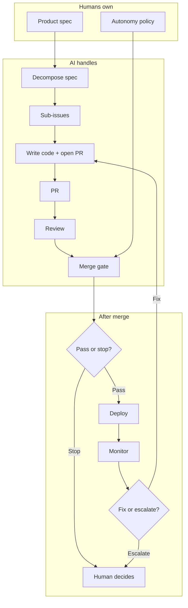

# PRD to Prod

An autonomous software pipeline: you write a product spec as a GitHub issue,
and AI agents implement it, review it, merge it, and deploy it — while humans
keep control over policy, secrets, and what the system is allowed to do.

Built on [gh-aw](https://github.com/github/gh-aw) (GitHub Agentic Workflows).

## Latest: meeting-to-main

> Meeting transcript in. Merged PR out.

[meeting-to-main](https://github.com/samuelkahessay/meeting-to-main) takes M365 meeting context via WorkIQ MCP, extracts a
structured PRD, and feeds it into this pipeline. The first GitHub Agentic
Workflows + WorkIQ integration.

[Repo](https://github.com/samuelkahessay/meeting-to-main)

> **Try it:** visit [`/operator/login`](https://prd-to-prod.azurewebsites.net/operator/login)
> for demo credentials. The [`/operator`](https://prd-to-prod.azurewebsites.net/operator) dashboard is public read-only.



## What Humans Own vs. What AI Does

| Humans decide | AI handles |
|---|---|
| What to build (specs, acceptance criteria) | Breaking specs into tasks, writing code, reviewing PRs |
| What the system is allowed to do ([`autonomy-policy.yml`](autonomy-policy.yml)) | Merging safe changes, fixing CI failures |
| Workflow rules, secrets, deploy config, branch protection | Everything else inside those guardrails |

If the system encounters something not covered by policy, it stops and asks a human.

## How It Works

1. You write a product spec as a GitHub issue.
2. `prd-decomposer` breaks it into ordered sub-issues with acceptance criteria.
3. `repo-assist` picks up each issue, writes the code, and opens a PR.
4. `pr-review-agent` reviews the diff against the spec and policy.
5. `pr-review-submit` merges if everything passes, or stops and flags a human.
6. If CI breaks after merge, the system tries to fix it automatically — or escalates.

Every step is visible in GitHub: issues, PRs, reviews, and workflow runs.

## Agents

The pipeline uses specialized agents, each with a single job. GitHub Actions workflows handle routing between them — agents don't coordinate with each other directly.

| Agent | What it does |
|---|---|
| **Repo Assist** | Implements issues and opens PRs |
| **PR Review Agent** | Reviews diffs against the spec |
| **PRD Decomposer** | Splits a spec into ordered sub-issues |
| **PRD Architecture Planner** | Creates an implementation plan before coding starts |
| **CI Failure Doctor** | Diagnoses failed CI runs |
| **Code Simplifier** | Proposes cleanup PRs |
| **Duplicate Code Detector** | Finds and refactors duplication |
| **Security Compliance Campaign** | Fixes critical vulnerabilities |
| **Pipeline Status Report** | Maintains a rolling status dashboard |

Supporting workflows handle the glue: dispatching issues to agents, converting review verdicts into GitHub reviews, routing CI failures into bug issues, cleaning up stale work, and choosing the right deploy target.

## Dashboards

- [`/operator`](https://prd-to-prod.azurewebsites.net/operator) — see what the pipeline decided and why
- [`/pipeline`](https://prd-to-prod.azurewebsites.net/pipeline) — live view of GitHub workflow activity
- [`autonomy-policy.yml`](autonomy-policy.yml) — what the system is and isn't allowed to do
- [`docs/decision-ledger/`](docs/decision-ledger/README.md) — structured log of all pipeline decisions
- [`drills/reports/`](drills/reports/) — self-healing test results

## Known Limits

- **Platform dependency** — relies on GitHub, Copilot, and Azure being available.
- **One thing at a time** — `repo-assist` handles one issue at a time (no parallel implementation yet).
- **Imperfect failure detection** — auto-repair is only as good as the error messages in CI logs.
- **No auto-rollback** — the system can fix or escalate, but won't automatically revert a bad deploy.
- **Manual policy changes** — workflow rules, secrets, and deploy config stay human-only by design.

## What's Been Built With It

Everything below was built by the pipeline itself — not hand-coded. Running it against real work also produced 28 self-healing drill reports and 14 upstream bug fixes merged into [gh-aw](https://github.com/github/gh-aw) (as of 2026-03-05).

### Apps

| Run | App | Stack | Tag |
|---|---|---|---|
| 01 | [Code Snippet Manager](showcase/01-code-snippet-manager/) | Express + TypeScript | [`v1.0.0`](https://github.com/samuelkahessay/prd-to-prod/tree/v1.0.0) |
| 02 | [Pipeline Observatory](showcase/02-pipeline-observatory/) | Next.js 14 + TypeScript | [`v2.0.0`](https://github.com/samuelkahessay/prd-to-prod/tree/v2.0.0) |
| 03 | [DevCard](showcase/03-devcard/) | Next.js 14 + TypeScript + Framer Motion | [`v3.0.0`](https://github.com/samuelkahessay/prd-to-prod/tree/v3.0.0) |
| 04 | [Ticket Deflection Service](https://prd-to-prod.azurewebsites.net/) | ASP.NET Core + C# | [`v4.0.0`](https://github.com/samuelkahessay/prd-to-prod/tree/v4.0.0) |
| 05 | [Compliance Scan Service](showcase/05-compliance-scan/) | ASP.NET Core + C# | [`v5.0.0`](https://github.com/samuelkahessay/prd-to-prod/tree/v5.0.0) |

See [`showcase/`](showcase/) for run manifests, PR lists, and timelines.

### Bugs Found in gh-aw

| Release | Issues |
|---|---|
| [`v0.51.3`](https://github.com/github/gh-aw/releases/tag/v0.51.3) | [#19023](https://github.com/github/gh-aw/issues/19023) Mixed-trigger concurrency group collapse, [#19024](https://github.com/github/gh-aw/issues/19024) Malformed `#aw_*` references pass without validation |
| [`v0.51.6`](https://github.com/github/gh-aw/releases/tag/v0.51.6) | [#19158](https://github.com/github/gh-aw/issues/19158) `gh aw checks --json` collapses optional failures into top-level state, [#19020](https://github.com/github/gh-aw/issues/19020) Auto-merge gating ignores non-required deployment statuses |
| [`v0.53.0`](https://github.com/github/gh-aw/releases/tag/v0.53.0) | [#19476](https://github.com/github/gh-aw/issues/19476) `push_repo_memory` has no retry/backoff on concurrent pushes, [#19475](https://github.com/github/gh-aw/issues/19475) `get_current_branch` leaks stderr outside git repos, [#19474](https://github.com/github/gh-aw/issues/19474) Unconditional agent-output download causes ENOENT noise, [#19473](https://github.com/github/gh-aw/issues/19473) Copilot engine fallback uses `--model` flag instead of `COPILOT_MODEL` env var |
| [`v0.53.3`](https://github.com/github/gh-aw/releases/tag/v0.53.3) | [#19605](https://github.com/github/gh-aw/issues/19605) `handle_create_pr_error` crashes conclusion job on API failure, [#19606](https://github.com/github/gh-aw/issues/19606) Transient search failure creates duplicate No-Op Runs issues, [#19607](https://github.com/github/gh-aw/issues/19607) Recompile-needed issues missing `agentic-workflows` label |

## Quick Start

```bash
git clone https://github.com/samuelkahessay/prd-to-prod.git
cd prd-to-prod

gh extension install github/gh-aw
bash scripts/bootstrap.sh
gh aw secrets bootstrap
git push
```

Then create an issue with your product spec and comment `/decompose`.

Before relying on auto-merge, verify these repo settings: auto-merge enabled, delete branch on merge enabled, and an active `Protect main` ruleset.

For the `.NET + Azure` setup, see [docs/SELF_HEALING_MVP.md](docs/SELF_HEALING_MVP.md).

### Required Secrets

- `COPILOT_GITHUB_TOKEN`
- `GH_AW_GITHUB_TOKEN`
- `GH_AW_PROJECT_GITHUB_TOKEN`
- `AZURE_CLIENT_ID`
- `AZURE_TENANT_ID`
- `AZURE_SUBSCRIPTION_ID`

### Required Repo Settings

- Auto-merge enabled
- Delete branch on merge enabled
- Active `Protect main` ruleset on `main`

### Emergency Controls

Set the repository variable `PIPELINE_HEALING_ENABLED=false` to pause auto-repair. The system still detects and records failures, but won't dispatch fixes or auto-merge until you re-enable it.

## Further Reading

- [**Autonomy Policy**](autonomy-policy.yml) — what the system can and can't do
- [**Architecture**](docs/ARCHITECTURE.md) — how workflows and agents are organized
- [**Self-Healing MVP**](docs/SELF_HEALING_MVP.md) — setup and self-repair runbook
- [**Why gh-aw**](docs/why-gh-aw.md) — why GitHub Actions workflows are the control layer
- [**Why Not App Builders**](docs/why-not-app-builders.md) — how this differs from Lovable, Base44, etc.

## License

MIT
