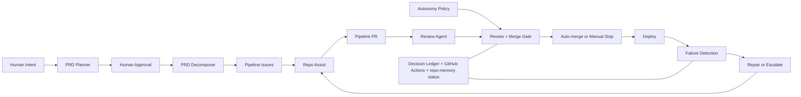

# Architecture

## System Thesis

`prd-to-prod` is an AI-powered software delivery system with clear human boundaries.
The current repository contains 26 workflow YAML files, but the useful mental
model is not a flat count. It is a set of routing/safety workflows plus AI agent workflows.

- Humans own intent, policy, escalation rules, and authority expansion.
- gh-aw agents handle the work that requires judgment.
- Standard GitHub Actions remain the deterministic authority layer for routing,
  merge enforcement, deploy, and incident state transitions.

## Consolidation Target State

prd-to-prod is consolidating from three repos into one source repo with an exported scaffold artifact and a generated template publication target. The system supports two operating modes:

### Repository Boundaries

`prd-to-prod` is the source product. Workflow sources, scaffold files, setup
scripts, product docs, and publication automation are hand-edited here only.

`prd-to-prod-template` is the generated customer install artifact. It remains
the GitHub template people start from, but it is published from this repo and is
not a second source tree.

Customer-created repositories are runtime instances. They hold customer code,
repo secrets, activation variables, and operational history. They can diverge in
application code, but pipeline framework changes flow back through source PRs in
`prd-to-prod`.

### Instance Feedback Loop

Downstream product runs are evidence, not alternate authorities. When a runtime
instance discovers a generic improvement, the promotion path is:

1. Capture the instance finding with enough evidence to reproduce it.
2. Strip product-specific code, data, and private repo state.
3. Open or land the generic change in `prd-to-prod`.
4. Regenerate and publish `prd-to-prod-template` from source.
5. Let customer repos opt into the updated scaffold through their normal update
   or setup flow.

Downstream learnings follow this path too: the lesson can be upstreamed when
generic, but the instance repo itself is not mutated by core recovery work.

### Operating Modes

1. **greenfield** — Meeting transcript → PRD → new repo provisioned from scaffold
2. **existing** — Meeting transcript → issues filed into `TARGET_REPO`

Mode selection is handled by `extraction/run.sh` via `--mode auto|greenfield|existing`. When `--mode auto` (default), the classifier analyzes the transcript and routes accordingly.

### Ingress Layer (`extraction/`)

| Script | Role |
|---|---|
| `run.sh` | Unified entrypoint — routes to greenfield or existing path |
| `classify.sh` | Transcript classifier — returns `{classification, confidence, signals, product_match}` |
| `extract-prd.sh` | Greenfield path — generates validated PRD from transcript |
| `extract-issues.sh` | Existing path — extracts structured issues from transcript |
| `validate.sh` | Structural PRD validation (sections, tech stack guard) |

### Scaffold Export (`scaffold/`)

The scaffold is a build artifact generated from `template-manifest.yml`, not a hand-maintained fork. The export pipeline:

1. `export-scaffold.sh` — copies allowlisted paths, renders templates, compiles workflows
2. `leak-test.sh` — verifies no forbidden paths (extraction/, trigger/, product code) leak into scaffold
3. `bootstrap-test.sh` — smoke-tests the exported scaffold (file completeness, config validity)
4. `publish-scaffold-template.yml` — mirrors `dist/scaffold/` into the generated template repo used by `/build`

Output goes to `dist/scaffold/`, which is `.gitignore`d. The published template repo at `PUBLIC_BETA_TEMPLATE_OWNER/PUBLIC_BETA_TEMPLATE_REPO` is generated output, not a maintained source repo.
The canonical template repo should not be operated as though it were a live
customer instance; scheduled agent loops are activated only after a created repo
passes setup verification and sets `PIPELINE_ENABLED=true`.

### Trigger Layer (`trigger/`)

| Script | Role |
|---|---|
| `push-to-pipeline.sh` | Greenfield — provisions new repo from `dist/scaffold/` |
| `push-to-existing.sh` | Existing — creates `[Pipeline]` issues in `TARGET_REPO` |

The local greenfield trigger provisions directly from `dist/scaffold/`. The self-serve console provisions from the published generated template repo using the same scaffold contents.

### Key Invariants

- `TARGET_REPO` is required when `--mode existing` is set; omitting it fails fast
- The scaffold never contains `extraction/`, `trigger/`, `PRDtoProd/`, or product-specific files
- All hand edits happen in `prd-to-prod`; the published template repo is regenerated from `dist/scaffold/`
- The published template is setup-activated: scheduled agent workflows no-op until `PIPELINE_ENABLED=true`
- `classify.sh` is deterministic: same input always produces same output
- Schema validation gates all inter-script data (JSON Schema files in `extraction/schemas/`)

## High-Level Flow



## What Humans Control

The AI lane is intentionally bounded. The following remain human-owned:

- product intent and acceptance criteria
- `autonomy-policy.yml`
- workflow files and agent instructions
- secrets, tokens, and kill switches
- deployment routing and target changes
- branch protection and merge-scope expansion
- sensitive-path approval when app changes cross policy boundaries

The system is designed to stop rather than silently widen its own authority.

## Planning Layer

An architecture planning step sits between PRD intake and decomposition:

```
PRD Issue → /plan → prd-planner → Architecture Comment + JSON Artifact
  → /approve-architecture → prd-decomposer (architecture-aware) → Issues
```

- **`prd-planner`** (gh-aw agent): Reads the PRD + deploy profile + existing codebase. Produces a human-readable architecture comment on the issue and a structured JSON artifact in repo-memory at `architecture/{issue-number}.json`.
- **`architecture-approve.yml`**: Listens for `/approve-architecture`, verifies write access, swaps `architecture-draft` → `architecture-approved`, dispatches the decomposer.
- **Downstream integration**: `prd-decomposer` uses approved architecture artifacts for issue sequencing, component references, and pattern consistency. `repo-assist` reads them for implementation context.
- **Autonomy policy**: `architecture_planning` is autonomous. The human approval gate (`/approve-architecture`) is the review boundary.
- **Low-risk skip**: A genuinely single-issue, low-risk PRD may skip planning only with an `architecture-skip-approved` label and a human-authored `planning-skip:v1` marker explaining the reason.

See `docs/plans/2026-03-03-architecture-planning-pipeline-design.md` for full design.

> **Status**: Planning is mandatory for multi-issue, high-risk, shared-contract,
> auth, compliance, payment, deployment, workflow, or policy work. To use it,
> post `/plan` as a comment on a PRD issue, review the generated architecture,
> then post `/approve-architecture` before `/decompose`.

## Workflow Groups

### 1. Entry Points and Routing

These workflows decide what enters the autonomous lane and when.

| Workflow | Role |
|---|---|
| `prd-decomposer.lock.yml` | Converts PRDs into dependency-ordered pipeline issues with acceptance criteria, concrete contract file paths, and required validation commands |
| `auto-dispatch.yml` | Accepts `pipeline` issues, classifies actionability, debounces, and dispatches `repo-assist` |
| `auto-dispatch-requeue.yml` | Starts the next deferred issue after the current `repo-assist` run finishes |

Key property: the entry point is centralized. `pipeline` is the lane marker; actionability
is decided inside the workflow rather than scattered across label combinations.

### 2. Agent Workflows

These workflows perform the bounded AI work.

| Workflow | Role |
|---|---|
| `repo-assist.lock.yml` | Implements issues, maintains PRs, handles review feedback, and repairs bounded CI failures while reading issue-carried contract paths and required validation commands |
| `pr-review-agent.lock.yml` | Reviews the full diff against acceptance criteria, required validation evidence, and repo contract drift, then posts `[PIPELINE-VERDICT]` |
| `pr-review-submit.yml` | Parses verdicts, submits formal reviews, enforces the merge gate, and arms auto-merge only inside policy |

Key property: the agent workflow lane is real, but not unrestricted. The merge gate is
where policy becomes operational.

Decomposed issues now carry two Markdown sections that make fidelity enforceable without a second artifact format:

- `## Existing Contracts to Read` lists the concrete repo files an implementer and reviewer must read before judging correctness.
- `## Required Validation` starts with `bash scripts/validate-implementation.sh` and then lists any issue-specific contract checks that must pass before a PR can be considered complete.

### 3. Delivery and Recovery

These workflows handle CI, deploy, repair routing, and stall recovery.

| Workflow | Role |
|---|---|
| `ci-node.yml` | Build and test for the supported Next.js/Node lane |
| `deploy-router.yml` | Chooses the current deploy workflow based on `.deploy-profile` |
| `deploy-vercel.yml` | Deploys Next.js runs to Vercel |
| `ci-failure-issue.yml` | Converts failed CI or deploy runs into repair commands or escalation issues |
| `ci-failure-resolve.yml` | Marks active repair incidents resolved when CI recovers |
| `pipeline-watchdog.yml` | Detects stalled PRs, orphaned issues, and stale repair loops |
| `close-issues.yml` | Deterministically closes linked issues on merge |

Key property: self-healing is a bounded recovery loop inside the larger system,
not a claim that every failure is automatically diagnosed or rolled back.

### 4. Planning Agents

These workflows support the architecture planning gate.

| Workflow | Trigger | Role |
|---|---|---|
| `prd-planner.lock.yml` | `/plan` slash command on issues | Generates architecture comment and JSON artifact from a PRD |
| `architecture-approve.yml` | `/approve-architecture` comment on `architecture-draft` issues | Swaps label to `architecture-approved`, dispatches decomposer |

Key property: the planning chain is the default risk gate. Without an approved
architecture artifact, `prd-decomposer` only proceeds when a human records a
low-risk `planning-skip:v1` reason.

### 5. Continuous Improvement Agents

These agents run on schedules or events to improve the codebase between pipeline
runs. They do not own the merge boundary — they open PRs or issues for human or
pipeline review.

| Workflow | Trigger | Schedule | Role |
|---|---|---|---|
| `pipeline-status.lock.yml` | schedule | Daily 19:14 UTC | Maintains rolling pipeline status artifacts |
| `ci-doctor.lock.yml` | `workflow_run` (CI/deploy failure on `main`) | Event-driven | Diagnoses CI failures and posts structured analysis |
| `code-simplifier.lock.yml` | schedule | Daily 20:47 UTC | Proposes simplifications in recently changed code |
| `duplicate-code-detector.lock.yml` | schedule | Daily 9:53 UTC | Scans for duplication patterns across the codebase |
| `security-compliance.lock.yml` | `workflow_dispatch` only | Manual | Runs targeted PIPEDA/FINTRAC security and compliance checks |

**Activation notes:**

- `ci-doctor` only activates when the triggering workflow run concluded with
  `failure`. It correctly skips on success — a run showing `conclusion: skipped`
  means CI was green, not that the agent is broken.
- `code-simplifier` and `duplicate-code-detector` run daily via cron. If they
  show zero runs, check whether GitHub Actions disabled the workflow for
  inactivity (Settings > Actions > Workflows) and re-enable it.
- `code-simplifier` has a `skip-if-match` guard: it will not run if there is
  already an open PR titled `[code-simplifier]`.
- `security-compliance` is intentionally manual. Dispatch it before an audit or
  when targeted scanning is needed.

### 6. Infrastructure and Maintenance

| Workflow | Trigger | Role |
|---|---|---|
| `agentics-maintenance.yml` | Every 2 hours | Closes expired gh-aw discussions, issues, and PRs |
| `copilot-setup-steps.yml` | `workflow_dispatch`, push to its own path | Shared Copilot Agent environment setup |

Key property: these are supporting infrastructure. They do not produce
application changes.

## Operator Surfaces

The system exposes operator-facing artifacts instead of hiding the loop inside
GitHub Actions logs.

| Surface | Purpose |
|---|---|
| `autonomy-policy.yml` | Machine-readable authority boundary |
| `docs/decision-ledger/README.md` | Decision event schema |
| `drills/decisions/` | Seed decision events and demo fixtures exported with the scaffold |
| `repo-memory` status files | Rolling operational summaries written by agents |
| GitHub Actions logs | Auditable execution traces for agent and deterministic workflows |
| GitHub issues and PRs | Human-visible queue, review, escalation, and merge history |

Core product experiments may add richer console views, but generated template
repos should rely on the exported GitHub-native surfaces above unless they
explicitly add their own operator UI.

## Boundary Enforcement

The human/AI boundary is explicit in code and policy.

### Policy artifact

[`autonomy-policy.yml`](../autonomy-policy.yml) classifies actions as
`autonomous` or `human_required`. Unknown actions stop and ask a human.

### Merge gate

`pr-review-submit.yml` checks the policy before auto-merge. Approved
`[Pipeline]` PRs are merged only when their touched surfaces remain inside the
autonomous lane.

### Sensitive-path approval

Some app changes are intentionally allowed only with explicit human approval.
That approval path is narrower than general human-controlled edits and exists so
the system can stop, wait, and resume without pretending the boundary does not
exist.

### Rulesets and ownership

Branch protection, secrets, deploy targets, and merge-scope expansion remain
outside the autonomous lane. The system may observe and report on them, but it
does not redefine them.

## Self-Healing Loops

The repo currently ships three bounded recovery loops:

1. **CI repair loop**: failed CI or deploy run -> incident marker -> repair
   command or escalation issue -> `repo-assist` repair -> green CI or escalation.
2. **Watchdog stall loop**: stalled PR or orphaned actionable issue ->
   `pipeline-watchdog` redispatch or escalation.
3. **Superseded work cleanup**: merged work closes linked issues and removes
   stale duplicate PRs.

These loops are useful because they reduce operator toil. They are not a claim
of full autonomy.

## Repo-Memory Governance

Memory is advisory. Agents read it for continuity, but they must verify claims
against live GitHub issues, pull requests, branches, and checked-out repository
state before acting.

Operators can inspect and repair memory without editing generated workflow files:

```bash
bash scripts/repo-memory-governance.sh inspect memory/repo-assist
bash scripts/repo-memory-governance.sh prune memory/repo-assist
bash scripts/repo-memory-governance.sh prune memory/repo-assist --apply
bash scripts/repo-memory-governance.sh reset memory/repo-assist --apply
```

`prune` and `reset` are dry-run unless `--apply` is supplied. Use them when stale
repo-memory would cause duplicate PRs, skipped required work, or a poisoned
rerun.

## What the System Can Do Autonomously

- decompose PRDs into implementation issues
- implement application and test code
- review diffs against requirements and policy
- arm auto-merge for approved `[Pipeline]` PRs inside policy
- route bounded CI failures back into the repair loop
- requeue or redispatch stalled work
- surface operational state to humans

## What Still Requires a Human

- changing workflow definitions
- editing the policy artifact or widening authority
- rotating tokens or secrets
- changing deploy policy or destinations
- modifying rulesets and required checks
- approving changes that intentionally cross a human-required boundary
- deciding on rollback or broader incident response

## Design Decisions

### Deterministic workflows remain the authority layer

Judgment goes to gh-aw agents. Routing, policy enforcement, merge mechanics,
deploy, and incident state transitions stay deterministic.

### `[Pipeline]` is the autonomous merge lane

The pipeline does not auto-merge arbitrary approved PRs. The title prefix and
policy checks keep the autonomous lane narrow and inspectable.

### Identity separation is deliberate

The review agent posts a verdict comment. `github-actions[bot]` submits the
formal review and merge action. This avoids self-approval while preserving a
fully automated path inside the lane.

### Observability is a first-class feature

Decision logs, operator views, live pipeline visualization, and drill reports
exist because a real operator needs to know what the system is doing, what it
refused to do, and why.

## Secrets and Variables

### Secrets

| Secret | Purpose |
|---|---|
| `GH_AW_GITHUB_TOKEN` | Auto-merge, workflow dispatch, and GitHub API actions that must outlive `GITHUB_TOKEN` cascade limits |
| `COPILOT_GITHUB_TOKEN` | Copilot engine token for gh-aw workflows |
| `GH_AW_PROJECT_GITHUB_TOKEN` | Project board access for repo-assist updates |
| `VERCEL_TOKEN` / `VERCEL_ORG_ID` / `VERCEL_PROJECT_ID` | Vercel deploy identity |

### Repository Variables

| Variable | Purpose | Default |
|---|---|---|
| `PIPELINE_ENABLED` | Activation gate for scheduled agent workflows in template-created repos. Set to `true` only after setup verification passes. | unset/false |
| `PIPELINE_HEALING_ENABLED` | Kill switch for autonomous healing. Set to `false` to pause dispatch, repair, and auto-merge while keeping detection and recording active. | unset (healing enabled) |
| `GH_AW_MODEL_AGENT_COPILOT` | Optional model override for Copilot-powered gh-aw agents. | gh-aw default |

## Repo Settings

The live repo is expected to keep these in place:

- auto-merge enabled
- delete branch on merge enabled
- squash merge allowed
- active `Protect main` ruleset on `main`
- required approval and required `review` status check

## Related Documents

- [README](../README.md) — public system overview
- [Why gh-aw](why-gh-aw.md) — why the repo splits deterministic and agentic work
